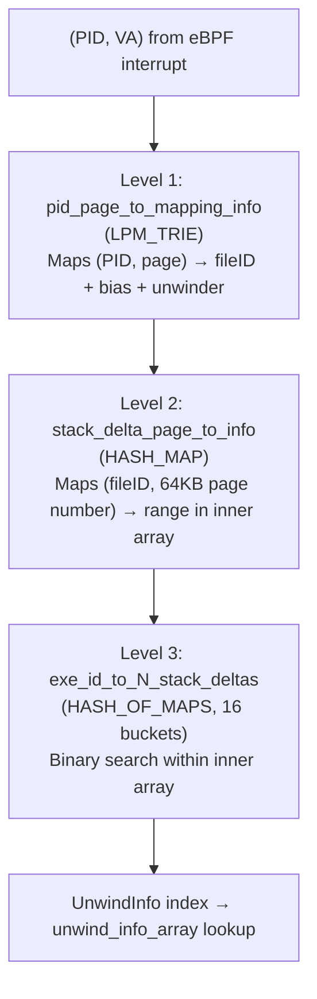

I've spent a good chunk of the past week reading through the [opentelemetry-ebpf-profiler](https://github.com/open-telemetry/opentelemetry-ebpf-profiler) codebase, and I keep coming back to the same thought: this is one of the most carefully engineered pieces of systems software I've read in years. The problem it solves — continuous profiling across mixed-runtime workloads, with no frame pointers, no debug symbols, zero process restarts, kernel 5.4+ — is genuinely hard. The solutions it found are worth studying even if you never touch a profiler.

Let me walk you through what I found.

## The Core Insight: Compile the DWARF Away

If you've tried to implement stack unwinding without frame pointers, you've probably stared at `.eh_frame` for a while and felt vaguely hopeless. DWARF CFI is a stack machine with arbitrary expressions. It's designed for correctness, not speed. Running a DWARF interpreter in a hot interrupt path would be insane.

The otel-ebpf-profiler team's answer is elegant: don't interpret DWARF at runtime. Instead, run the DWARF virtual machine once, ahead of time, in userspace, and compile its output into a compressed lookup table that eBPF can query in microseconds.

The result is a two-phase architecture:

- **Userspace Host Agent (Go)**: Parses `.eh_frame`, `.debug_frame`, and `.gopclntab` from ELF files, runs the DWARF CFA interpreter, and distills the output into compact "stack delta" tables. These get loaded into eBPF maps.
- **eBPF (C)**: On each perf event, binary-searches the pre-loaded maps to find the stack delta for the current PC, then uses it to unwind one frame. Tail-calls itself. Repeat up to 29 times.

The entry point for the userspace extraction is `stackdeltaextraction.go:184`, function `extractFile()`. It tries data sources in a specific order:

```go
// stackdeltaextraction.go:203-218
if err = ee.parseGoPclntab(); err != nil { ... }
if err = ee.parseEHFrame(); err != nil { ... }
if err = ee.parseDebugFrame(elfFile); err != nil { ... }
```

Go binaries first, then `.eh_frame`, then `.debug_frame` as a last resort. When a Go binary has *both* `.gopclntab` and `.eh_frame` (it usually does — the C runtime parts have `.eh_frame`), an `extractionFilter` selects `.gopclntab`-covered ranges first and fills gaps from `.eh_frame`. That's the PLT stubs, C library calls, etc.

## The DWARF VM Implementation

`elfehframe.go` implements a full DWARF CFA interpreter. `state.step()` at line 605 handles about 30 DWARF opcodes. The interesting part isn't the common cases — `cfaDefCfa`, `cfaOffset`, etc. are straightforward. It's how they deal with `cfaDefCfaExpression` and `cfaExpression`, the opcodes that emit arbitrary DWARF stack programs.

They don't evaluate arbitrary expressions. Instead, they pattern-match against a small set of known shapes (lines 492–532):

- The GCC-generated PLT trampoline pattern
- `REG + offset`
- `*(REG + offset)`
- `*(REG1 + 8*REG2 + offset) + postOffset` — this one showed up in OpenSSL hand-written assembly

That last pattern is particularly telling. Somebody actually went and decompiled OpenSSL's assembly to figure out what DWARF expression GCC was emitting for it, then added a special case. That's the kind of attention to detail that makes this project interesting.

If an expression doesn't match any known pattern, it falls back to "unknown", which means the unwinder gives up at that frame. Acceptable. Full correctness would require shipping a DWARF stack machine into the kernel, and nobody wants that.

## The Stack Delta Encoding

After all the DWARF interpretation, what do you actually store in the eBPF maps? Here's the representation (`types.h:872-875`):

```c
typedef struct StackDelta {
  u16 addrLow;    // Low 16 bits of address (offset within 64KB page)
  u16 unwindInfo;  // Index into global UnwindInfo array, or special command flags
} StackDelta;
```

Four bytes per entry. The page-level granularity is the key — you only store the low 16 bits of the address, since the high bits are captured by the map key (fileID + page number). Then `unwindInfo` is an index into a global deduplication table:

```c
typedef struct UnwindInfo {
  u8 flags;        // UNWIND_FLAG_*
  u8 baseReg;      // CFA base register (RBP, RSP, RAX, ...)
  u8 auxBaseReg;   // Register for FP/return address recovery
  u8 mergeOpcode;  // Two-adjacent-delta merge optimization
  s32 param;       // CFA expression parameter (usually the stack offset)
  s32 auxParam;    // FP/RA expression parameter
} UnwindInfo;
```

Twelve bytes. The `unwind_info_array` is global across all executables — the observation being that the set of unique CFA expressions in a typical system isn't that large. They measured it: `/usr/bin/*` and `/usr/lib/*.so` on a desktop system produce about 9,700 unique `UnwindInfo` entries. The map ceiling is 16,384. So even with significant binary diversity, you're unlikely to hit the limit in practice.

The `mergeOpcode` field is a micro-optimization I didn't expect. Adjacent stack delta entries that represent a push/pop pair get merged into a single record using a 1-bit sign + 7-bit address threshold encoding. It reduces table size and, more importantly, reduces the number of eBPF map entries the binary search has to traverse.

## The Three-Level Map Hierarchy

Finding the right `StackDelta` for a given (PID, virtual address) requires three levels of lookup:



The Level 1 LPM Trie is particularly neat. Rather than inserting one entry per 64KB page of a memory mapping, the Go side uses a "rightmost set bit" splitting algorithm (`lpm/lpm.go`) to decompose `[start, end)` into the minimum number of power-of-two-aligned LPM prefixes. One `mmap()` region becomes a handful of trie entries, not thousands.

The Level 3 bucketing — 16 separate inner maps sized from 2^8 to 2^23 — solves a real eBPF problem. Inner maps in `HASH_OF_MAPS` must all have the same size at creation time. If you size for the worst case, small executables waste enormous amounts of memory. By creating 16 map sizes and assigning each executable to the smallest bucket that fits, memory usage scales with actual delta count rather than worst-case delta count. The selection logic is in `native_stack_trace.ebpf.c:28-63`.

The binary search itself (`get_stack_delta()` at line 168) uses the classic `for (i = 0; i < 16; i++)` pattern rather than a `while` loop. This isn't a style choice — it's required by the eBPF verifier, which needs statically bounded loops. The verifier also forces several null checks on values that logically can't be null (like `get_per_cpu_record()` results), but without them the program won't load.

## The Tail Call Architecture

Each eBPF program can only be so large. Complex unwinding logic for 11+ language runtimes can't fit in one program. The solution is tail call chains via `bpf_tail_call()`, managed through `perf_progs` (a `BPF_PROG_ARRAY` map).

Each `PROG_UNWIND_NATIVE` invocation handles exactly 5 frames, then tail-calls either itself (more native frames), an interpreter-specific unwinder (switched to a JVM/Python/Go heap frame), or `PROG_UNWIND_STOP`. The logic for deciding which tail call to make is `get_next_unwinder()` in `tracemgmt.h`.

The interpreter detection is worth looking at. Before any tail call, the code checks whether the current PC falls within a known interpreter's main loop range by looking it up in `interpreter_offsets` (a hash map keyed by PC range). This is how the profiler knows to switch from native unwinding to, say, JVM frame walking — without any cooperation from the JVM process.

Near the tail call limit (29/32), the system detects it's running low and jumps to `PROG_UNWIND_STOP` with whatever frames it's collected so far. You get a truncated but valid stack trace rather than garbage. That's the right behavior.

## Signal Frames and the vDSO Problem

Two corner cases that would break naive unwinding: signal frames and the vDSO.

Signal frames are detected either by checking the `S` augmentation character in the CIE (part of the DWARF metadata), or by pattern-matching the PC against the address of `rt_sigreturn`. When a signal frame is detected, the unwinder reads the `rt_sigframe` struct from the stack — at a fixed offset of 40 bytes on x86_64 — to recover 18 registers and resume unwinding from the interrupted context.

The vDSO is messier. The ARM64 vDSO doesn't have correct `.eh_frame` data. Rather than skipping it or hoping for frame pointers, `synthdeltas.go` literally disassembles the vDSO at profiler startup: it scans for `STP`/`LDP` instruction pairs, identifies frame setup/teardown patterns, and synthesizes fake stack delta entries from that analysis. It's the kind of thing you do when you've committed to actually working on ARM64 servers.

## Container Support: Leveraging /proc

The container story is surprisingly clean. There's no "container mode" — the profiler runs in the host PID namespace, which means:

1. eBPF returns host PIDs (not container-relative PIDs). `bpf_get_current_pid_tgid()` always gives you the host view.
2. `/proc/<HOST_PID>/` gives you everything about the container process without any namespace translation.

`getMappingFile()` in `process/process.go:401` has a three-tier fallback for accessing the actual binary files:

1. `/proc/<PID>/map_files/<addr>` — works even for files that have been deleted after being `dlopen()`'d (common in container image updates)
2. `/proc/<PID>/root/<path>` — follows the process's mount namespace root, piercing through overlay filesystems
3. `/proc/<PID>/task/<TID>/root` — fallback when the main thread has exited but other threads are still running

The cache key for parsed ELF files is `(device, inode)` — so two containers sharing a base image layer with identical shared libraries only cause one ELF parse. That's the `elfInfoCache` in `processmanager/processinfo.go:186`.

What you don't get: Kubernetes pod metadata. No labels, no namespace names. The profiler knows the container ID (extracted from `/proc/<PID>/cgroup` via regex matching against Docker/containerd/CRI-O formats) and exports it as `container.id`, but correlating that with K8s objects is left to the backend.

## Symbol Resolution: The Deliberate Split

For native C/C++/Rust binaries, the profiler doesn't resolve function names. It can't — the agent doesn't have access to debuginfo, and downloading it at runtime would add latency and complexity. Instead, it ships the ELF virtual address plus the FileID and GNU Build ID to the backend. The backend can then look up the debug info (via debuginfod or its own symbol index) asynchronously.

The FileID scheme (`libpf/fileid.go:114-170`) is SHA-256 over the first 4KiB + last 4KiB + length of the file. Notably, this is entirely independent of any symbol or debug information — it's purely a content fingerprint of the ELF structure. The code has a rather emphatic comment about this:

> ANY CHANGE IN BEHAVIOR CAN EASILY BREAK OUR INFRASTRUCTURE, POSSIBLY MAKING THE ENTIRETY OF THE DEBUG INDEX OR FRAME METADATA WORTHLESS

Go binaries are the exception. `.gopclntab` is in a `PT_LOAD` segment, so it survives stripping. Even a fully stripped Go binary retains full function name, source file, and line number information. The fallback search for `gopclntab` magic bytes across all read-only `PT_LOAD` segments (`elfgopclntab.go:304-346`) means it finds the table even in PIE binaries where the section table has been stripped.

For interpreted runtimes — JVM, CPython, V8, Ruby, PHP, Erlang, .NET — the profiler reads directly from process memory via `process_vm_readv`, following the interpreter's own data structures to reconstruct symbolic frames. This is the Loader/Data/Instance abstraction in `interpreter/types.go`:

```go
type Loader func(ebpf EbpfHandler, info *LoaderInfo) (Data, error)
type Data interface { Attach(...) (Instance, error); Unload(...) }
type Instance interface { Symbolize(...) error; Detach(...) error }
```

Detection happens by looking at the process's `dynsym` for well-known symbols. `libjvm.so` presence means HotSpot. `v8dbg_*` dynamic symbols mean V8. Each interpreter gets its own Instance per process, and they share Data structures (the parsed offsets for a given JVM version, for instance) across all processes running that same JVM binary.

## The Coredump Testing Trick

This is my favorite engineering decision in the whole codebase.

eBPF programs are famously hard to test. You can't just run them in a unit test — you need a kernel, you need to trigger the right perf events, you need to introspect the map state. The team's solution: compile the same eBPF C code into a userspace CGO binary using a `TESTING_COREDUMP` preprocessor flag.

```c
#if defined(TESTING_COREDUMP)
  static inline long bpf_probe_read_user(void *buf, u32 sz, const void *ptr) {
    long __bpf_probe_read_user(u64, void *, u32, const void *);
    return __bpf_probe_read_user(__cgo_ctx->id, buf, sz, ptr);
  }
#endif
```

Every BPF helper gets a Go implementation that operates on actual coredump data. The eBPF unwinding logic — the binary search, the frame recovery, everything — runs in a normal test process against real coredump files. If it produces the right stack trace from a coredump, it will produce the right stack trace at runtime.

This is the kind of testability infrastructure that separates serious projects from toys.

## The Known Warts

No honest analysis skips the rough edges.

**The new-process race**: When a new process starts, the first perf event that hits it triggers a PID report and returns immediately — the trace is discarded. The userspace processes the PID event, loads the ELF, populates the maps, and then subsequent samples work. Short-lived processes that die before the second sample are invisible. This is acknowledged in `tracemgmt.h` with "technically this is not SMP safe" — the comment is understating it.

**The unbuffered channel**: `traceCh` in `controller.go:171` is unbuffered. The goroutine that reads from the perf buffer (G4) is directly coupled to the goroutine that processes traces (G5). Under high off-CPU event rates, G5 becomes a bottleneck and backs up into G4. The code at `events.go:240-241` acknowledges this explicitly.

**The 16384 UnwindInfo limit**: It's a constant, not a configuration parameter. On a system with a lot of unique binary variants — think heavily patched containerized services — you could hit it. There's no graceful degradation path documented for when you do.

**The technical debt**: I counted four `FIXME` comments in the .NET implementation alone (`dotnet/method.go:202`, `dotnet/instance.go:479`), plus a `TEMPORARY HACK` in `interpreter_dispatcher.ebpf.c:280-295` for filtering malformed single-frame traces. These aren't dealbreakers but they're worth knowing about if you're running this in production.

**The verifier tax**: A significant fraction of the eBPF C code exists purely to satisfy the verifier's static analysis, not because it's logically necessary. Every loop is bounded by a constant. Every map lookup result is null-checked even when it can't be null. The binary search that would naturally be `while (lo < hi)` is instead `for (int i = 0; i < 16; i++)`. This makes the code harder to read and reason about, which is an ironic cost for safety guarantees.

## What You Should Steal

If you're building any kind of userspace-kernel data pipeline over eBPF, a few patterns here are worth copying directly:

**Pre-compile the expensive stuff.** DWARF interpretation is the extreme case, but the principle applies broadly: do the heavy computation at load time, store the results in eBPF maps in a form the kernel program can consume cheaply.

**Use LPM tries for address range queries.** One trie entry per naturally-aligned power-of-two block covers arbitrary ranges with minimal entries. The `lpm/lpm.go` splitting algorithm is clean and portable.

**Bucket your inner maps.** If you're using `HASH_OF_MAPS` and the inner map sizes vary significantly, 16 buckets spanning powers of two is much more memory-efficient than one size fits all.

**Test with coredumps.** The `TESTING_COREDUMP` pattern — compiling the same eBPF C code as CGO with stub helpers — is genuinely brilliant. It lets you test the actual kernel-side logic with real data without needing a kernel.

**Use `BPF_NOEXIST` for event deduplication.** The inhibit_events latch in `tracemgmt.h:58-85` is a clean pattern for "send this event at most once" without any explicit locking.

---

The thing that keeps striking me about this codebase is how many decisions were clearly made by people who had already tried the naive approach and hit its limits. The bucketed maps, the coredump testing, the DWARF pre-compilation, the three-tier `/proc` fallback — none of these are the first thing you'd reach for. They're the things you arrive at after the first thing didn't work well enough. That's the signature of a codebase that's been through real production.

<!-- zh -->

上周我花了不少时间读 [opentelemetry-ebpf-profiler](https://github.com/open-telemetry/opentelemetry-ebpf-profiler) 的源码，越读越觉得这是近年来少见的精品系统软件。它要解决的问题本身就很难——在混合语言运行时（mixed-runtime）的工作负载中做持续 profiling，不依赖帧指针（frame pointer），不依赖调试符号（debug symbols），不重启进程，内核 5.4+——每一个约束单独拿出来都不好搞，叠在一起就更难了。即使你这辈子不会写 profiler，这套解法也值得认真看一遍。

## 核心思路：把 DWARF 在运行前就"编译"掉

凡是尝试过在没有帧指针的情况下实现栈回溯的人，大概都对着 `.eh_frame` 发过一阵呆。DWARF CFI（Call Frame Information）本质上是一个可以执行任意表达式的栈机器，它的设计目标是正确性，不是性能。在热路径的中断上下文里跑 DWARF 解释器，这个想法本身就不现实。

otel-ebpf-profiler 团队的答案很干脆：不在运行时解释 DWARF。而是提前在用户态跑一遍 DWARF 虚拟机，把输出压缩成一张查找表，eBPF 程序拿到它之后可以在微秒级别完成查询。

整体是一个两阶段架构：

- **用户态 Host Agent（Go）**：解析 ELF 文件里的 `.eh_frame`、`.debug_frame` 和 `.gopclntab`，驱动 DWARF CFA 解释器，把输出精简成紧凑的 "stack delta"（栈增量）表，加载进 eBPF maps。
- **eBPF（C）**：每次 perf 事件触发时，对预加载的 maps 做二分查找，找到当前 PC 对应的 stack delta，据此回溯一帧，然后 tail call 自身，最多重复 29 次。

用户态提取的入口在 `stackdeltaextraction.go:184` 的 `extractFile()` 函数，数据源的尝试顺序是固定的：

```go
// stackdeltaextraction.go:203-218
if err = ee.parseGoPclntab(); err != nil { ... }
if err = ee.parseEHFrame(); err != nil { ... }
if err = ee.parseDebugFrame(elfFile); err != nil { ... }
```

优先 Go 二进制专用的 `.gopclntab`，其次 `.eh_frame`，最后才是 `.debug_frame`。当一个 Go 二进制同时含有 `.gopclntab` 和 `.eh_frame` 时（这很常见——Go 二进制链接的 C 运行时部分有 `.eh_frame`），`extractionFilter` 会先取 `.gopclntab` 覆盖的地址范围，剩余的空隙（PLT 桩代码、C 库函数等）才从 `.eh_frame` 补充。

## DWARF 虚拟机的实现

`elfehframe.go` 实现了完整的 DWARF CFA 解释器。第 605 行的 `state.step()` 处理约 30 种 DWARF 操作码。常见的 `cfaDefCfa`、`cfaOffset` 这些都是直白的实现，没什么意外。真正有意思的是它怎么处理 `cfaDefCfaExpression` 和 `cfaExpression`——这两个操作码可以携带任意 DWARF 栈程序。

它没有真正求值任意表达式，而是对一组已知的表达式形状做模式匹配（第 492–532 行）：

- GCC 生成的 PLT trampoline 固定模式
- `REG + offset`
- `*(REG + offset)`
- `*(REG1 + 8*REG2 + offset) + postOffset`——这个是 OpenSSL 手写汇编里出现的

最后那个模式尤其说明问题。有人专门去反编译了 OpenSSL 的汇编，搞清楚 GCC 给它生成的是哪种 DWARF 表达式，然后加了一个 special case。这种专注程度让这个项目显得与众不同。

如果一个表达式不匹配任何已知模式，就回退到 "unknown"，unwinder 在那一帧停止。这是合理的取舍——要做到完全正确，就得把一个 DWARF 栈机器塞进内核，没人会这么干的。

## Stack Delta 的编码方案

DWARF 解释完之后，实际存进 eBPF maps 的是什么？结构定义在 `types.h:872-875`：

```c
typedef struct StackDelta {
  u16 addrLow;    // 地址低 16 位（64KB 页内偏移）
  u16 unwindInfo;  // 全局 UnwindInfo 数组的索引，或特殊命令标志
} StackDelta;
```

每条记录 4 字节。以页为粒度是关键——地址的高位已经被 map key（fileID + 页号）捕获了，这里只需存低 16 位。`unwindInfo` 是一个全局去重表的索引：

```c
typedef struct UnwindInfo {
  u8 flags;        // UNWIND_FLAG_*
  u8 baseReg;      // CFA 基址寄存器（RBP, RSP, RAX...）
  u8 auxBaseReg;   // FP/返回地址恢复用的基址寄存器
  u8 mergeOpcode;  // 相邻两条 delta 的合并操作码
  s32 param;       // CFA 表达式参数（通常是栈偏移量）
  s32 auxParam;    // FP/RA 表达式参数
} UnwindInfo;
```

12 字节。`unwind_info_array` 是全系统共享的——背后的观察是：一个典型系统上，独特的 CFA 表达式组合其实没有那么多。他们实测过：桌面系统上的 `/usr/bin/*` 和 `/usr/lib/*.so` 大约产生 9700 个唯一的 `UnwindInfo` 条目，而上限是 16384。就算二进制多样性相当高，实践中也不太容易触顶。

`mergeOpcode` 字段是个我没预期到的微优化。相邻的两条 stack delta 如果构成 push/pop 对，可以用 1 bit 符号 + 7 bit 地址差阈值的编码合并成一条记录。这既缩减了表的大小，更重要的是减少了二分查找需要遍历的条目数。

## 三级 Map 查找架构

给定一对 (PID, 虚拟地址)，要找到正确的 `StackDelta` 需要三级查找：


第一级的 LPM Trie（最长前缀匹配字典树）设计得很精巧。并不是每个 64KB 页插一条记录，而是 Go 侧用"最右置位位"分割算法（`lpm/lpm.go`）把 `[start, end)` 分解成数量最少的、自然对齐的 2 的幂次前缀。一个 `mmap()` 映射区域只产生寥寥几条 trie 记录，而不是几千条。

第三级的分桶设计——16 个从 2^8 到 2^23 大小不等的内层 map——解决了一个真实的 eBPF 工程问题。`HASH_OF_MAPS` 中的内层 map 必须在创建时就固定大小，如果按最坏情况分配，小的可执行文件会浪费大量内存。通过预建 16 种尺寸的 map，每个可执行文件分配到能容纳其 delta 数量的最小桶，内存占用就能随实际数据量线性增长，而不是对齐到最坏情况。选桶逻辑在 `native_stack_trace.ebpf.c:28-63`。

二分查找本身（`get_stack_delta()`，第 168 行）用的是经典的 `for (i = 0; i < 16; i++)` 形式，而不是 `while` 循环。这不是代码风格问题——eBPF verifier（验证器）要求所有循环有静态上界。同理，verifier 还强制要求对逻辑上不可能为 NULL 的值（比如 `get_per_cpu_record()` 的返回值）做 null check，不加就无法加载程序。

## Tail Call 链式架构

单个 eBPF 程序的大小有限制，11 种以上语言运行时的回溯逻辑根本塞不进一个程序。解决方案是通过 `bpf_tail_call()` 做链式跳转，跳转表是一个 `BPF_PROG_ARRAY` 类型的 map，叫做 `perf_progs`。

每次 `PROG_UNWIND_NATIVE` 调用处理恰好 5 帧，然后 tail call 到：自身（还有更多 native 帧）、某个解释器专属的 unwinder（遇到了 JVM/Python/Go 堆帧），或者 `PROG_UNWIND_STOP`。决定跳向哪里的逻辑是 `tracemgmt.h` 里的 `get_next_unwinder()`。

解释器检测这里值得多说一句。每次 tail call 之前，代码会查询 `interpreter_offsets` 这个 hash map，检查当前 PC 是否落在某个已知解释器的主循环地址范围内。这就是 profiler 在不侵入 JVM 进程的前提下，知道该切换到 JVM 帧遍历模式的方式。

当 tail call 次数接近上限（29/32）时，系统会检测到余量不足，直接跳到 `PROG_UNWIND_STOP`，提交已经收集的部分栈帧。你拿到的是截断但有效的调用栈，而不是垃圾数据。这是正确的降级策略。

## 信号帧与 vDSO 的处理

有两个边界情况会让朴素的 unwinder 翻车：信号帧（signal frame）和 vDSO。

信号帧的检测方式有两种：检查 CIE（Common Information Entry）中的 `S` augmentation 字符，或者将 PC 与 `rt_sigreturn` 的地址做模式匹配。一旦检测到信号帧，unwinder 从栈上读取 `rt_sigframe` 结构体——在 x86_64 上固定偏移 40 字节——恢复 18 个寄存器，然后从被中断的上下文继续回溯。

vDSO 更麻烦一些。ARM64 的 vDSO 没有正确的 `.eh_frame` 数据。`synthdeltas.go` 的做法是在 profiler 启动时直接反汇编 vDSO：扫描 `STP`/`LDP` 指令对，识别帧建立和销毁的模式，合成出假的 stack delta 条目。愿意做到这一步，说明他们是认真要在 ARM64 服务器上跑通的。

## 容器支持：把 /proc 用到极致

容器这块的设计出人意料地干净。没有什么"容器模式"——profiler 直接跑在宿主机 PID namespace 里，这带来两个天然属性：

1. eBPF 返回的始终是宿主机视角的 PID，`bpf_get_current_pid_tgid()` 永远给你宿主机的 PID，不是容器内的 PID。
2. `/proc/<HOST_PID>/` 能拿到容器进程的一切信息，不需要任何 namespace 转换。

`process/process.go:401` 的 `getMappingFile()` 实现了三级回退策略来访问实际的二进制文件：

1. `/proc/<PID>/map_files/<addr>`——即使文件已经被删除也能打开（容器镜像更新后，旧版共享库被删除但进程仍在用，这种情况很常见）。
2. `/proc/<PID>/root/<path>`——内核提供的符号链接，指向进程的文件系统根目录，可以穿透 overlay 文件系统访问容器内的文件。
3. `/proc/<PID>/task/<TID>/root`——主线程退出但其他线程还在跑时的兜底方案。

解析过的 ELF 文件的缓存键是 `(device, inode)`——所以两个容器如果共享同一个基础镜像层，它们的共享库有相同的设备号和 inode，profiler 只需解析一次。这是 `processmanager/processinfo.go:186` 的 `elfInfoCache`。

有一点要说清楚：Kubernetes 的 Pod 元数据这里是拿不到的，没有 label，没有 namespace 名。profiler 能从 `/proc/<PID>/cgroup` 里用正则提取容器 ID（兼容 Docker/containerd/CRI-O 格式），以 `container.id` 这个标准 OTel 资源属性导出，但把容器 ID 关联到 K8s 对象这件事，得留给后端去做。

## 符号解析：刻意的分层

对于原生的 C/C++/Rust 二进制，profiler 不在 agent 端解析函数名。做不到——agent 没有 debuginfo，运行时去下载又会带来延迟和复杂性。实际的做法是把 ELF 虚拟地址加上 FileID 和 GNU Build ID 一起发给后端，后端拿到 Build ID 之后可以异步去查 debuginfo（通过 debuginfod 或自有符号索引）。

FileID 的计算方案（`libpf/fileid.go:114-170`）是对文件头部 4KiB + 尾部 4KiB + 文件长度做 SHA-256。关键点是它完全不依赖任何符号或调试信息，纯粹是 ELF 结构的内容指纹。代码里有一段措辞相当强烈的注释：

> ANY CHANGE IN BEHAVIOR CAN EASILY BREAK OUR INFRASTRUCTURE, POSSIBLY MAKING THE ENTIRETY OF THE DEBUG INDEX OR FRAME METADATA WORTHLESS

（任何行为变更都可能破坏我们的整个基础设施，让所有的调试索引和帧元数据彻底作废。）

Go 二进制是个例外。`.gopclntab` 存在 `PT_LOAD` segment 里，`strip` 命令动不了它。一个完全 stripped 的 Go 二进制仍然保留完整的函数名、源文件名和行号信息。`elfgopclntab.go:304-346` 的回退逻辑会在所有只读 `PT_LOAD` segment 里搜索 pclntab 的 magic bytes，所以即使是 PIE 二进制、section table 已被 strip，也能找到它。

对于解释型语言的运行时——JVM、CPython、V8、Ruby、PHP、Erlang、.NET——profiler 通过 `process_vm_readv` 系统调用直接读取进程内存，顺着解释器自己的数据结构重建符号帧。这是 `interpreter/types.go` 里的 Loader/Data/Instance 三层抽象：

```go
type Loader func(ebpf EbpfHandler, info *LoaderInfo) (Data, error)
type Data interface { Attach(...) (Instance, error); Unload(...) }
type Instance interface { Symbolize(...) error; Detach(...) error }
```

解释器检测通过查看进程的 `dynsym` 动态符号表来完成：有 `libjvm.so` 就是 HotSpot，有 `v8dbg_*` 开头的动态符号就是 V8。每个解释器给每个进程创建一个独立的 Instance，但 Data 结构（比如某个 JVM 版本的内部偏移量解析结果）在运行同一 JVM 二进制的所有进程间共享。

## Coredump 测试方案

这是整个代码库里我最欣赏的一个工程决策。

eBPF 程序出了名地难测试。你没法直接写单元测试——需要内核，需要触发正确的 perf 事件，需要检查 map 的状态。团队的解法是：用 `TESTING_COREDUMP` 预处理器开关把同一份 eBPF C 代码编译成一个用户态的 CGO 二进制。

```c
#if defined(TESTING_COREDUMP)
  static inline long bpf_probe_read_user(void *buf, u32 sz, const void *ptr) {
    long __bpf_probe_read_user(u64, void *, u32, const void *);
    return __bpf_probe_read_user(__cgo_ctx->id, buf, sz, ptr);
  }
#endif
```

每个 BPF helper 都有一个对应的 Go 实现，操作的是真实的 coredump 数据。eBPF 的回溯逻辑——二分查找、帧恢复，全部——在一个普通的测试进程里对着真实 coredump 文件运行。能从 coredump 产出正确的调用栈，就说明运行时也能产出正确的调用栈。

能不能把 eBPF 程序测好，是区分认真项目和玩具项目的标准之一。

## 已知的坑

诚实的分析不会跳过那些还没解决好的地方。

**新进程竞态**：新进程启动时，第一个打到它的 perf 事件会触发 PID 上报然后立刻返回——这次采样被丢弃。用户态处理完 PID 事件、加载 ELF、填充 maps 之后，后续采样才能正常工作。生命周期短到第二次采样都来不及的进程，在这个 profiler 眼里是隐形的。`tracemgmt.h` 里用了一句 "technically this is not SMP safe" 来承认这个问题，但这句话低估了它的严重性。

**无缓冲 channel**：`controller.go:171` 的 `traceCh` 是无缓冲的，从 perf buffer 读取数据的 goroutine（G4）和处理 trace 的 goroutine（G5）直接耦合。off-CPU 事件量大时，G5 会成为瓶颈，反压到 G4。`events.go:240-241` 的注释明确承认了这一点。

**16384 条 UnwindInfo 的硬上限**：这是一个写死的常量，不是配置参数。在运行大量不同版本二进制的系统上——比如频繁滚动更新的容器化服务群——有可能触顶。触顶之后怎么降级，文档里没有。

**技术债**：仅 .NET 实现里我就数到了四处 `FIXME`（`dotnet/method.go:202`，`dotnet/instance.go:479`），加上 `interpreter_dispatcher.ebpf.c:280-295` 里一个处理畸形单帧 trace 的 `TEMPORARY HACK`。放生产不是不行，但心里要有数。

**Verifier 税**：eBPF C 代码里相当一部分内容纯粹是为了满足 verifier 的静态分析，逻辑上没有必要。所有循环都要加常量上界，所有 map 查询结果都要判 null（即使结果逻辑上不可能为 null），本来应该是 `while (lo < hi)` 的二分查找变成了 `for (int i = 0; i < 16; i++)`。这让代码变得更难读、更难推理——为了安全保证付出的代价，讽刺的是降低了另一个维度的可靠性。

## 值得直接借鉴的模式

如果你在用 eBPF 构建任何用户态-内核数据管线，有几个模式可以直接抄：

**把昂贵的计算推到加载期完成。** DWARF 预编译是极端案例，但原则通用：重计算在加载时做，结果以 eBPF 程序能廉价消费的形式存进 maps。

**地址范围查询用 LPM Trie。** 每个自然对齐的 2 的幂次块一条记录，就能以最少的条目覆盖任意范围。`lpm/lpm.go` 的分割算法干净且可移植。

**内层 map 做分桶。** 用 `HASH_OF_MAPS` 且内层 map 大小差异显著时，跨越 2 的幂次的 16 个分桶比单一尺寸的内存效率高得多。

**用 coredump 做测试。** `TESTING_COREDUMP` 这个模式——把同一份 eBPF C 代码加上桩函数编译成 CGO——真的很聪明，让你在没有内核的情况下用真实数据测试内核侧逻辑。

**用 `BPF_NOEXIST` 做事件去重。** `tracemgmt.h:58-85` 的 inhibit_events 闩锁，是"每个事件最多发一次"这个需求的干净实现，不需要任何显式锁。

---

读完这份代码，让我一直回味的一点是：里面很多决策，明显是做过朴素方案、碰过壁之后才有的。分桶 map、coredump 测试、DWARF 预编译、三级 `/proc` 回退——这些都不是第一次动手会想到的。它们是第一个方案跑起来不够好之后，逼出来的答案。这是一个真正经历过生产考验的代码库才会有的气质。
